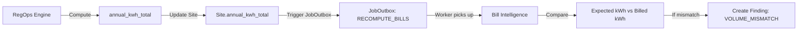
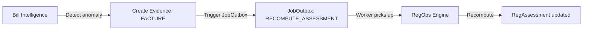
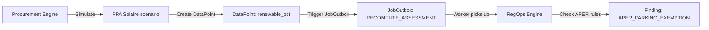
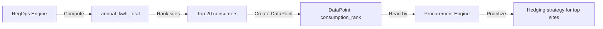

# BRICKS INTERFACES - PROMEOS POC
**Date**: 2026-02-09
**Status**: Brique 1 ✅ Implemented | Brique 2/3 📐 Design

---

## OVERVIEW

PROMEOS architecture is built around **3 autonomous briques** (bricks) that communicate through **standardized JSON contracts**:

1. **Brique 1: RegOps** (Compliance engine + AI agents) - ✅ IMPLEMENTED
2. **Brique 2: Bill Intelligence** (Anomaly detection + cost optimization) - 📐 PLANNED
3. **Brique 3: Scénarios Achat Post-ARENH** (Procurement strategy simulator) - 📐 PLANNED

Each brique:
- Has its own **domain models** (DB tables)
- Exposes **API endpoints** (REST)
- Produces **outputs** (findings, actions, insights)
- Consumes **inputs** from other briques (via DataPoints, Evidence, cross-references)

---

## DESIGN PRINCIPLES

### 1. Loose Coupling

Briques do NOT import each other's code. They communicate via:
- **Database tables** (shared models: Site, Organisation, Evidence, DataPoint)
- **JSON payloads** (standardized schemas)
- **Foreign keys** (object_type + object_id polymorphic pattern)

### 2. Event-Driven Communication

Briques react to **data changes** via JobOutbox pattern:
- Brique 1 creates DataPoint → Triggers JobOutbox → Brique 2 recomputes bills
- Brique 2 detects anomaly → Creates Evidence → Triggers JobOutbox → Brique 1 recomputes compliance

### 3. Read-Only Cross-Brick Access

Briques can **read** each other's outputs but **never modify** them:
- Brique 2 reads RegAssessment.compliance_score (Brique 1 output)
- Brique 3 reads Bill.annual_cost (Brique 2 output)
- Brique 1 reads ProcurementScenario.estimated_savings (Brique 3 output)

### 4. Shared Vocabulary

All briques use **common enums** (Severity, Confidence, RegStatus) and **base schemas** (Finding, Action, Evidence).

---

## CORE CONTRACTS (JSON Schemas)

### Contract 1: Finding (Compliance Issue)

**Producer**: Brique 1 (RegOps rules), Brique 2 (Bill anomalies)
**Consumer**: Action Plan, Dashboard, Alerts

```typescript
interface Finding {
  // Identity
  regulation: RegulationType;  // "TERTIAIRE_OPERAT", "BACS", "APER", "CEE_P6", "BILL_ANOMALY"
  rule_id: string;  // Unique rule ID (e.g., "TERTIAIRE_AREA_SCOPE", "BILL_PRICE_SPIKE")

  // Status
  status: RegStatus;  // "COMPLIANT", "AT_RISK", "NON_COMPLIANT", "UNKNOWN", "OUT_OF_SCOPE", "EXEMPTION_POSSIBLE"
  severity: Severity;  // "LOW", "MEDIUM", "HIGH", "CRITICAL"
  confidence: Confidence;  // "HIGH", "MEDIUM", "LOW" (certainty of assessment)

  // Context
  legal_deadline?: Date;  // Regulatory deadline (ISO 8601)
  trigger_condition: string;  // Human-readable condition (e.g., "tertiaire_area_m2 >= 1000")
  explanation: string;  // Why this finding exists (2-3 sentences)

  // Data lineage
  config_params: Record<string, any>;  // YAML config used (e.g., {scope_threshold_m2: 1000})
  inputs_used: string[];  // Fields used (e.g., ["tertiaire_area_m2", "parking_area_m2"])
  missing_inputs: string[];  // Required fields missing (e.g., ["operat_status"])

  // Evidence requirements
  evidence_required?: TypeEvidence[];  // Evidence types needed to resolve (e.g., ["AUDIT", "FACTURE"])
  evidence_deadline?: Date;  // When evidence must be provided

  // Financial impact (optional)
  estimated_cost_eur?: number;  // Estimated cost of non-compliance
  potential_savings_eur?: number;  // Savings if resolved

  // Audit
  source: "DETERMINISTIC" | "AI" | "EXTERNAL";  // Who produced this finding
  source_version?: string;  // Version of rule/AI model
  computed_at: DateTime;  // When computed (ISO 8601)
}
```

**Example (Brique 1 - RegOps)**:
```json
{
  "regulation": "TERTIAIRE_OPERAT",
  "rule_id": "TERTIAIRE_MISSING_OPERAT_DATA",
  "status": "UNKNOWN",
  "severity": "MEDIUM",
  "confidence": "HIGH",
  "legal_deadline": "2026-09-30",
  "trigger_condition": "operat_status IS NULL",
  "explanation": "Le site est dans le champ du décret tertiaire (≥1000m²) mais aucun statut OPERAT n'est renseigné. Impossible de déterminer la conformité.",
  "config_params": {"scope_threshold_m2": 1000},
  "inputs_used": ["tertiaire_area_m2"],
  "missing_inputs": ["operat_status", "operat_last_submission_year"],
  "evidence_required": ["RAPPORT"],
  "source": "DETERMINISTIC",
  "source_version": "regs.yaml@abc123",
  "computed_at": "2026-02-09T14:30:00Z"
}
```

**Example (Brique 2 - Bill Intelligence)**:
```json
{
  "regulation": "BILL_ANOMALY",
  "rule_id": "BILL_PRICE_SPIKE",
  "status": "AT_RISK",
  "severity": "HIGH",
  "confidence": "MEDIUM",
  "trigger_condition": "unit_price > 0.25 EUR/kWh (>3σ above org avg)",
  "explanation": "Facture janv 2026 présente un prix unitaire anormalement élevé (0.32 EUR/kWh vs moyenne org 0.18 EUR/kWh). Possible erreur tarifaire.",
  "config_params": {"sigma_threshold": 3},
  "inputs_used": ["unit_price", "org_avg_price", "org_stddev_price"],
  "missing_inputs": [],
  "evidence_required": ["FACTURE"],
  "estimated_cost_eur": 4200.0,
  "potential_savings_eur": 4200.0,
  "source": "DETERMINISTIC",
  "source_version": "bill_rules@v1.2",
  "computed_at": "2026-02-09T14:30:00Z"
}
```

---

### Contract 2: Action (Recommended Action)

**Producer**: Brique 1 (RegOps), Brique 2 (Bill fixes), Brique 3 (Procurement)
**Consumer**: Action Plan, Assignment, Tracking

```typescript
interface Action {
  // Identity
  action_code: string;  // Unique code (e.g., "TERTIAIRE_SUBMIT_OPERAT", "BILL_CONTEST_CHARGE")
  label: string;  // User-facing label (e.g., "Soumettre déclaration OPERAT")

  // Prioritization
  priority_score: number;  // 0-100 (high = urgent + high impact)
  urgency_reason: string;  // Why urgent (e.g., "Échéance dans 45j")

  // Assignment
  owner_role: string;  // "ENERGY_MANAGER", "FACILITY_MANAGER", "PROCUREMENT_MANAGER"
  owner_site_id?: number;  // Specific site (if site-level action)

  // Effort estimate
  effort: "QUICK" | "MEDIUM" | "LONG";  // Time estimate (hours/days/weeks)
  effort_hours?: number;  // Estimated hours

  // Impact
  expected_impact: string;  // "compliance", "cost_reduction", "risk_mitigation"
  expected_impact_eur?: number;  // Financial impact (€)
  expected_completion_date?: Date;  // Target completion

  // CEE hints (if applicable)
  cee_p6_hints?: string[];  // CEE P6 codes (e.g., ["BAT-TH-116", "BAT-EN-101"])
  cee_estimated_kwh_cumac?: number;  // CEE potential (kWh cumac)

  // AI flag (CRITICAL)
  is_ai_suggestion: boolean;  // TRUE if from AI, FALSE if deterministic
  ai_rationale?: string;  // Why AI suggests this (if is_ai_suggestion=true)
  needs_human_review: boolean;  // Requires human validation

  // Evidence
  required_evidence?: TypeEvidence[];  // Evidence needed to complete

  // Audit
  source: "DETERMINISTIC" | "AI" | "USER";
  computed_at: DateTime;
}
```

**Example (Brique 1 - RegOps Deterministic)**:
```json
{
  "action_code": "BACS_INSTALL_GTB",
  "label": "Installer une GTB (classe B ou A)",
  "priority_score": 85,
  "urgency_reason": "Échéance réglementaire : 2025-01-01 (dans 11 mois)",
  "owner_role": "FACILITY_MANAGER",
  "owner_site_id": 42,
  "effort": "LONG",
  "effort_hours": 120,
  "expected_impact": "compliance",
  "expected_impact_eur": 0,
  "expected_completion_date": "2024-12-01",
  "cee_p6_hints": ["BAT-TH-116"],
  "cee_estimated_kwh_cumac": 25000,
  "is_ai_suggestion": false,
  "needs_human_review": false,
  "required_evidence": ["CERTIFICAT", "RAPPORT"],
  "source": "DETERMINISTIC",
  "computed_at": "2026-02-09T14:30:00Z"
}
```

**Example (Brique 2 - Bill Intelligence)**:
```json
{
  "action_code": "BILL_CONTEST_CHARGE",
  "label": "Contester la facture auprès du fournisseur",
  "priority_score": 78,
  "urgency_reason": "Économie potentielle : 4200 EUR",
  "owner_role": "ENERGY_MANAGER",
  "owner_site_id": 15,
  "effort": "QUICK",
  "effort_hours": 2,
  "expected_impact": "cost_reduction",
  "expected_impact_eur": 4200,
  "is_ai_suggestion": false,
  "needs_human_review": true,
  "required_evidence": ["FACTURE", "CONTRAT"],
  "source": "DETERMINISTIC",
  "computed_at": "2026-02-09T14:30:00Z"
}
```

**Example (Brique 1 - AI Suggestion)**:
```json
{
  "action_code": "AI_SUGGEST_SOLAR_PARKING",
  "label": "Installer des ombrières solaires sur le parking",
  "priority_score": 65,
  "urgency_reason": "ROI estimé : 7 ans (bon retour investissement)",
  "owner_role": "FACILITY_MANAGER",
  "owner_site_id": 42,
  "effort": "LONG",
  "expected_impact": "cost_reduction",
  "expected_impact_eur": 15000,
  "is_ai_suggestion": true,
  "ai_rationale": "Le parking extérieur de 5000m² reçoit un bon ensoleillement (région Sud-Est). Production estimée : 600 MWh/an. Coûts évités : 15k EUR/an.",
  "needs_human_review": true,
  "source": "AI",
  "computed_at": "2026-02-09T14:30:00Z"
}
```

---

### Contract 3: Evidence (Compliance Proof)

**Producer**: All briques (upload), External connectors
**Consumer**: All briques (validate findings)

```typescript
interface Evidence {
  // Identity
  id: number;
  site_id: number;

  // Type
  type: TypeEvidence;  // "AUDIT", "FACTURE", "RAPPORT", "CERTIFICAT", "CONTRAT", "ATTESTATION"
  subtype?: string;  // Free-form (e.g., "BACS_INSPECTION", "AUDIT_ENERGETIQUE")

  // Status
  statut: StatutEvidence;  // "EN_ATTENTE", "VALIDE", "REJETE", "EXPIRE"
  validated_at?: DateTime;
  validated_by_user_id?: number;
  rejection_reason?: string;

  // Content
  date_document?: Date;  // Date on the document
  fichier_url?: string;  // File URL (S3, local, etc.)
  note?: Text;  // Free-form notes

  // Metadata
  source: "UPLOAD" | "CONNECTOR" | "API";  // How evidence was created
  source_ref?: string;  // External reference (e.g., "enedis_invoice_12345")

  // Cross-brick references
  related_finding_ids?: number[];  // Which findings this evidence resolves
  related_action_ids?: number[];  // Which actions this evidence completes

  // Audit
  created_at: DateTime;
  updated_at: DateTime;
}
```

**Example (Brique 1 - RegOps)**:
```json
{
  "id": 42,
  "site_id": 15,
  "type": "CERTIFICAT",
  "subtype": "BACS_INSTALLATION",
  "statut": "VALIDE",
  "validated_at": "2026-02-08T16:00:00Z",
  "validated_by_user_id": 3,
  "date_document": "2025-12-15",
  "fichier_url": "s3://promeos/evidences/site15_bacs_cert.pdf",
  "note": "Certificat d'installation GTB classe B par Schneider Electric",
  "source": "UPLOAD",
  "related_finding_ids": [102, 103],
  "related_action_ids": [205],
  "created_at": "2026-02-08T10:00:00Z",
  "updated_at": "2026-02-08T16:00:00Z"
}
```

**Example (Brique 2 - Bill Intelligence)**:
```json
{
  "id": 88,
  "site_id": 20,
  "type": "FACTURE",
  "subtype": "ELECTRICITY_BILL",
  "statut": "VALIDE",
  "date_document": "2026-01-31",
  "fichier_url": "s3://promeos/bills/site20_jan2026.pdf",
  "note": "Facture EDF janv 2026 - Anomalie tarifaire détectée et contestée",
  "source": "CONNECTOR",
  "source_ref": "enedis_invoice_987654",
  "related_finding_ids": [250],
  "related_action_ids": [380],
  "created_at": "2026-02-01T08:00:00Z",
  "updated_at": "2026-02-09T14:00:00Z"
}
```

---

## CROSS-BRICK DATA FLOWS

### Flow 1: Brique 1 → Brique 2 (RegOps feeds Bill Intelligence)

**Trigger**: RegOps computes annual_kwh_total for a site



**Data Contract**:
```json
// Site (shared table)
{
  "id": 15,
  "annual_kwh_total": 450000,  // ← Produced by Brique 1
  "last_energy_update_at": "2026-02-09T14:30:00Z"
}

// Brique 2 reads this value
bills_engine.detect_volume_anomaly(
  site_id=15,
  expected_kwh=450000,  // From Brique 1
  billed_kwh=480000     // From bills
)
→ Finding: "Volume mismatch: +6.7% (30,000 kWh unexplained)"
```

---

### Flow 2: Brique 2 → Brique 1 (Bill anomaly triggers compliance review)

**Trigger**: Bill Intelligence detects a cost anomaly



**Data Contract**:
```json
// Evidence created by Brique 2
{
  "id": 99,
  "site_id": 15,
  "type": "FACTURE",
  "subtype": "ANOMALY_DETECTED",
  "note": "Prix unitaire anormal : 0.32 EUR/kWh (moyenne org : 0.18)",
  "source": "BILL_INTELLIGENCE",
  "created_at": "2026-02-09T14:30:00Z"
}

// Brique 1 sees new evidence → triggers recompute
→ RegAssessment.is_stale = TRUE
→ JobOutbox: RECOMPUTE_ASSESSMENT (site_id=15)
```

---

### Flow 3: Brique 3 → Brique 1 (Procurement scenario affects compliance)

**Trigger**: Procurement scenario suggests buying renewable energy (affects APER compliance)



**Data Contract**:
```json
// DataPoint created by Brique 3
{
  "object_type": "site",
  "object_id": 15,
  "metric": "renewable_energy_pct",
  "value": 85.0,  // 85% renewable
  "unit": "%",
  "source_type": "API",
  "source_name": "procurement_simulator",
  "source_ref": "scenario_123",
  "retrieved_at": "2026-02-09T14:30:00Z"
}

// Brique 1 reads this → APER rule considers it
→ Finding: "APER parking obligation partially met by renewable procurement"
```

---

### Flow 4: Brique 1 → Brique 3 (RegOps compliance informs procurement strategy)

**Trigger**: RegOps identifies large consumption sites (priority for hedging)



**Data Contract**:
```json
// DataPoint created by Brique 1
{
  "object_type": "site",
  "object_id": 15,
  "metric": "annual_kwh_rank",
  "value": 3.0,  // 3rd largest consumer in org
  "unit": "rank",
  "source_type": "API",
  "source_name": "regops_engine",
  "retrieved_at": "2026-02-09T14:30:00Z"
}

// Brique 3 reads this → prioritizes site in procurement scenarios
→ ProcurementScenario: "Hedge 80% for top 5 sites (including site 15)"
```

---

## SHARED TABLES (Cross-Brick)

### Tables ALL Briques Can Write To

| Table | Brique 1 | Brique 2 | Brique 3 |
|-------|----------|----------|----------|
| **DataPoint** | ✅ Write (energy metrics) | ✅ Write (cost metrics) | ✅ Write (procurement metrics) |
| **Evidence** | ✅ Write (compliance docs) | ✅ Write (bills, contracts) | ✅ Write (procurement contracts) |
| **JobOutbox** | ✅ Write (recompute jobs) | ✅ Write (bill analysis jobs) | ✅ Write (simulation jobs) |
| **AiInsight** | ✅ Write (compliance insights) | ✅ Write (cost insights) | ✅ Write (strategy insights) |

### Tables Briques Only READ From

| Table | Brique 1 | Brique 2 | Brique 3 |
|-------|----------|----------|----------|
| **Site** | ✅ Read/Write (owns compliance fields) | ✅ Read only | ✅ Read only |
| **Organisation** | ✅ Read only | ✅ Read only | ✅ Read only |
| **Compteur** | ✅ Read (for consumption aggregation) | ✅ Read (for bill validation) | ✅ Read (for hedging volume) |
| **Consommation** | ✅ Read (for RegOps rules) | ✅ Read (for anomaly detection) | ✅ Read (for load profiles) |

### Tables Briques Own (Private)

| Table | Owner | Other Briques |
|-------|-------|---------------|
| **RegAssessment** | Brique 1 | ✅ Read only (cached compliance status) |
| **RegSourceEvent** | Brique 1 | ✅ Read only (regulatory news) |
| **EnergyBill** (future) | Brique 2 | ✅ Read only (billing data) |
| **BillAnomaly** (future) | Brique 2 | ✅ Read only (detected issues) |
| **ProcurementScenario** (future) | Brique 3 | ✅ Read only (strategy options) |
| **MarketData** (future) | Brique 3 | ✅ Read only (spot/forward prices) |

---

## API CONVENTIONS (Cross-Brick)

### Naming

- **Brique 1**: `/api/regops/*`, `/api/connectors/*`, `/api/watchers/*`, `/api/ai/*`
- **Brique 2**: `/api/bills/*`, `/api/tariffs/*`
- **Brique 3**: `/api/procurement/*`, `/api/market-data/*`

### Shared Endpoints

All briques must implement:

#### GET /api/{brick}/health

**Response**:
```json
{
  "status": "healthy" | "degraded" | "unhealthy",
  "version": "1.2.0",
  "uptime_seconds": 86400,
  "last_computation": "2026-02-09T14:30:00Z",
  "dependencies": {
    "database": "healthy",
    "external_apis": "degraded"
  }
}
```

#### GET /api/{brick}/metrics

**Response** (Prometheus format):
```
# HELP requests_total Total HTTP requests
# TYPE requests_total counter
requests_total{brick="regops",method="GET",status="200"} 12345

# HELP computation_duration_seconds Time to compute assessment
# TYPE computation_duration_seconds histogram
computation_duration_seconds_bucket{brick="regops",le="0.5"} 8901
```

---

## ERROR HANDLING (Cross-Brick)

### Standard Error Response

All briques return errors in this format:

```json
{
  "error": {
    "code": "MISSING_DATA",
    "message": "Cannot compute compliance: tertiaire_area_m2 is NULL",
    "details": {
      "site_id": 15,
      "missing_fields": ["tertiaire_area_m2", "operat_status"]
    },
    "brick": "regops",
    "timestamp": "2026-02-09T14:30:00Z",
    "request_id": "req_abc123"
  }
}
```

### Standard Error Codes

| Code | HTTP Status | Description |
|------|-------------|-------------|
| MISSING_DATA | 422 | Required input data is NULL |
| INVALID_INPUT | 400 | Input validation failed |
| COMPUTATION_FAILED | 500 | Internal computation error |
| EXTERNAL_API_FAILED | 503 | External API unavailable |
| RATE_LIMIT_EXCEEDED | 429 | Too many requests |
| AUTH_REQUIRED | 401 | Authentication missing |
| INSUFFICIENT_PERMISSIONS | 403 | User lacks required role |

---

## VERSIONING STRATEGY

### API Versioning

- **Current**: No versioning (all `/api/...`)
- **Target**: `/api/v1/regops/...`, `/api/v1/bills/...`, `/api/v1/procurement/...`

### Schema Versioning

Each JSON contract includes a `schema_version` field:

```json
{
  "schema_version": "1.0",
  "regulation": "TERTIAIRE_OPERAT",
  ...
}
```

**Breaking changes** → increment major version (1.0 → 2.0)
**Non-breaking additions** → increment minor version (1.0 → 1.1)

---

## TESTING STRATEGY (Cross-Brick)

### Contract Tests

Ensure JSON schemas are respected:

```python
def test_regops_finding_schema():
    """Test RegOps produces valid Finding objects"""
    finding = regops_engine.evaluate_site(site_id=1).findings[0]

    # Required fields
    assert "regulation" in finding
    assert "rule_id" in finding
    assert "status" in finding
    assert "severity" in finding
    assert "confidence" in finding

    # Enums
    assert finding["status"] in ["COMPLIANT", "AT_RISK", "NON_COMPLIANT", "UNKNOWN", "OUT_OF_SCOPE", "EXEMPTION_POSSIBLE"]
    assert finding["severity"] in ["LOW", "MEDIUM", "HIGH", "CRITICAL"]
    assert finding["confidence"] in ["HIGH", "MEDIUM", "LOW"]

def test_bill_finding_compatible_with_regops():
    """Test Brique 2 findings are compatible with Brique 1"""
    bill_finding = bill_intelligence.detect_anomalies(site_id=1)[0]

    # Should be parseable by Brique 1
    assert bill_finding["regulation"] == "BILL_ANOMALY"
    assert "severity" in bill_finding
    assert "estimated_cost_eur" in bill_finding
```

### Integration Tests

Test full data flows:

```python
def test_bill_anomaly_triggers_regops_recompute():
    """Test Brique 2 → Brique 1 flow"""
    # Brique 2 detects anomaly
    bill_intelligence.create_finding(site_id=15, rule_id="BILL_PRICE_SPIKE")

    # Should trigger job
    jobs = db.query(JobOutbox).filter(
        JobOutbox.job_type == JobType.RECOMPUTE_ASSESSMENT,
        JobOutbox.payload_json.contains('"site_id": 15')
    ).all()
    assert len(jobs) == 1

    # Process job
    job_worker.process_one(jobs[0].id)

    # RegOps should have recomputed
    assessment = db.query(RegAssessment).filter(
        RegAssessment.object_type == "site",
        RegAssessment.object_id == 15
    ).first()
    assert assessment.computed_at > bill_finding.created_at
```

---

## FUTURE EXTENSIONS

### Brique 4: Renewable Energy Tracking

**Inputs**:
- Brique 1: Site locations (lat/lon)
- Brique 3: PPA contracts

**Outputs**:
- DataPoints: renewable_kwh_produced, renewable_pct
- Findings: RE2020_TARGET_MET, GO_CERTIFICATES_NEEDED
- Actions: PURCHASE_GO, INSTALL_SOLAR

---

### Brique 5: Carbon Accounting

**Inputs**:
- Brique 1: Consumption (kWh)
- Brique 4: Renewable % (DataPoints)
- Connectors: RTE eCO2mix (grid intensity)

**Outputs**:
- DataPoints: annual_tco2e, scope2_emissions
- Findings: CSRD_REPORTING_REQUIRED, BEGES_DUE
- Actions: REDUCE_EMISSIONS, PURCHASE_OFFSETS

---

## DOCUMENTATION

### For Developers

Each brique must provide:

1. **OpenAPI spec** (`/api/{brick}/openapi.json`)
2. **Schema examples** (`docs/schemas/{brick}/`)
3. **Integration guide** (`docs/integrations/{brick}.md`)
4. **Contract tests** (`tests/contracts/test_{brick}.py`)

### For Users

- **RegOps Guide**: `docs/regops_ultimate.md` ✅ Exists
- **Bill Intelligence Guide**: `docs/bill_intelligence.md` (TODO)
- **Procurement Guide**: `docs/procurement_guide.md` (TODO)

---

## NEXT STEPS

1. **Immediate**:
   - Validate Finding/Action schemas with Pydantic (30 min)
   - Add schema_version to all JSON outputs (15 min)

2. **Short Term**:
   - Implement contract tests (2 hours)
   - Document Brique 2/3 interfaces (1 hour)
   - Add /health and /metrics to all bricks (30 min)

3. **Medium Term**:
   - API versioning (/api/v1/) (2 hours)
   - Cross-brick integration tests (4 hours)
   - OpenAPI schema export (1 hour)

---

**Status**: 🟢 **SOLID DESIGN** - Contracts defined, Brique 1 implemented
**Blocker**: None - Ready for Brique 2/3 development
**Reference**: See INVENTORY.md for Brique 2/3 table/API designs
